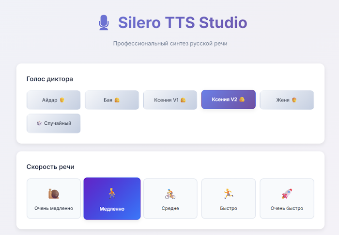

# Silero TTS Studio

Локальный веб-интерфейс для синтеза русской речи на базе [Silero TTS](https://github.com/snakers4/silero-models). Все вычисления происходят на вашем компьютере — данные никуда не отправляются.



## Возможности

- **6 голосов** — Айдар, Бая, Ксения V1, Ксения V2, Евгений, Случайный
- **5 скоростей речи** — от очень медленной до очень быстрой (через SSML)
- **Авто-ударения** — автоматическая расстановка ударений с помощью [silero-stress](https://pypi.org/project/silero-stress/)
- **Ручная корректировка** — поставьте `+` после гласной для ручного ударения
- **История генераций** — прослушивание, скачивание и удаление прямо в браузере
- **Авто-очистка** — временные аудиофайлы удаляются при остановке сервера
- **Высокое качество** — WAV 48 кГц

## Установка в одну команду

**Linux / macOS / Git Bash:**
```bash
curl -sSL https://raw.githubusercontent.com/sanchousmutant/Silero-TTS-Studio/main/install.sh | bash
```

**Windows (PowerShell):**
```powershell
irm https://raw.githubusercontent.com/sanchousmutant/Silero-TTS-Studio/main/install.ps1 | iex
```

Скрипт автоматически клонирует репозиторий, создаст виртуальное окружение, установит зависимости и предложит запустить приложение.

## Ручная установка

### 1. Клонирование и установка

```bash
git clone https://github.com/sanchousmutant/Silero-TTS-Studio.git
cd Silero-TTS-Studio

# Создание виртуального окружения (рекомендуется)
python -m venv .venv
.venv\Scripts\activate    # Windows
# source .venv/bin/activate  # Linux/macOS

# Установка зависимостей
pip install flask numpy scipy torch silero-stress
```

### 2. Запуск

```bash
python app.py
```

Откройте в браузере: **http://localhost:5000**

При первом запуске модели скачаются автоматически.

### 3. Запуск через ярлык (Windows)

Для удобства можно создать ярлык на рабочем столе:

```powershell
powershell -ExecutionPolicy Bypass -File .\Create_Desktop_Shortcut.ps1
```

Также можно запустить напрямую через `Start_Silero_TTS.bat`.

## Использование

1. Введите текст на русском языке
2. Нажмите **"Поставить ударения"** для автоматической обработки
3. Выберите голос и скорость речи
4. Нажмите **"Сгенерировать аудио"** (или `Ctrl+Enter`)

## Горячие клавиши

| Комбинация | Действие |
|---|---|
| `Ctrl + Enter` | Сгенерировать аудио |
| `Ctrl + Shift + S` | Поставить ударения |

## API

| Метод | Путь | Описание |
|---|---|---|
| GET | `/` | Главная страница |
| POST | `/add_stress` | Расстановка ударений |
| POST | `/synthesize` | Генерация аудио |
| GET | `/audio/<filename>` | Отдача аудиофайла |
| POST | `/delete_audio` | Удаление файла |

## Структура проекта

```
├── app.py                          # Flask-сервер и API
├── templates/index.html            # HTML-шаблон интерфейса
├── static/
│   ├── style.css                   # Стили
│   └── script.js                   # Клиентская логика
├── hubconf.py                      # Конфигурация загрузки моделей
├── models.yml                      # Описание доступных моделей
├── src/                            # Исходники Silero
├── Start_Silero_TTS.bat            # Запуск через bat-файл
├── Start_Silero_TTS_With_Browser.vbs  # Запуск с открытием браузера
├── Create_Desktop_Shortcut.ps1     # Создание ярлыка на рабочем столе
├── install.sh                      # Установщик (Linux/macOS/Git Bash)
├── install.ps1                     # Установщик (Windows PowerShell)
└── requirements.txt                # Зависимости
```

## Технологии

- **Backend:** Python, Flask, PyTorch, Silero TTS v3/v5, silero-stress
- **Frontend:** HTML5, CSS, JavaScript, Google Fonts (Inter)

## Лицензия

Проект использует модели Silero, распространяемые под лицензией [AGPL-3.0](LICENSE).

## Благодарности

- [Silero Models](https://github.com/snakers4/silero-models) — TTS-модели
- [silero-stress](https://pypi.org/project/silero-stress/) — расстановка ударений
